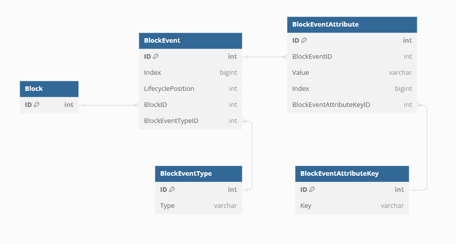

# Block Events Indexed Data

The application indexes Block BeginBlocker and EndBlocker events into a well-structured data shape. In this section, you will find an overview of what Block BeginBlocker and EndBlocker events are and how they are indexed by the application.

## Anatomy of a Block, BeginBlock and EndBlock Events

### Blocks

In Cosmos, every block has the following workflow (amongst other execution steps):

1. BeginBlocker - Execution of application-specific logic before transactions execute
2. Transaction Execution
3. EndBlocker - Execution of application-specific logic after transactions execute

The execution of the application-specific logic in BeginBlocker and EndBlocker steps results in events being emitted that are found in the block results dataset like so:

```json
{
    "result": {
        "begin_block_events": [...]
        "end_block_events": [...]
    }
}
```

These events can contain very useful information that can be used by indexers to track application execution.

### Block Events

Block events have the following data shape:

```json
{
    "type": "<event type>",
    "attributes": [
        {
            "key": "<attribute key>",
            "value": "<attribute value>",
            "index": true
        },
        ...<more attributes>
    ]
}
```

Each block event has a type, indicated by the top level `type` field. They also have any number of attributes which contain the arbitrary key/value pairs of data points associated with the event.

For a concrete example of a block event:

```
{
    "type": "coin_received",
    "attributes": [
        {
            "key": "receiver",
            "value": "cosmos1m3h30wlvsf8llruxtpukdvsy0km2kum8g38c8q",
            "index": true
        },
        {
            "key": "amount",
            "value": "8987882uatom",
            "index": true
        }
    ]
}
```

### Block Event Windows

It is important to keep the following in mind:

1. A single execution of an action in a block can emit multiple events
2. Block events are stored in an array in the block results dataset

This means that a single action may be found to require associating multiple events in a row to figure out exactly what happened. For instance, the following set of events seem to be associated to the same action (taken from an actual block on Cosmoshub - `19,744,082`):

```
 {
    "type": "coin_received",
    "attributes": [
        {
            "key": "receiver",
            "value": "cosmos1m3h30wlvsf8llruxtpukdvsy0km2kum8g38c8q",
            "index": true
        },
        {
            "key": "amount",
            "value": "8987882uatom",
            "index": true
        }
    ]
},
{
    "type": "coinbase",
    "attributes": [
        {
            "key": "minter",
            "value": "cosmos1m3h30wlvsf8llruxtpukdvsy0km2kum8g38c8q",
            "index": true
        },
        {
            "key": "amount",
            "value": "8987882uatom",
            "index": true
        }
    ]
},
{
    "type": "coin_spent",
    "attributes": [
        {
            "key": "spender",
            "value": "cosmos1m3h30wlvsf8llruxtpukdvsy0km2kum8g38c8q",
            "index": true
        },
        {
            "key": "amount",
            "value": "8987882uatom",
            "index": true
        }
    ]
}
```

The application applies the term **Block Event Windows** to this concept.

## Indexing Block Events

The application indexes block events into a well-structured data shape. For implementation details, see the [block.go](ttps://github.com/scalarorg/xchains-indexer/blob/main/db/models/block.go) file in the models package.

The indexed dataset has the following general overview:

1. Block BeginBlocker events are indexed per Block
2. Block EndBlocker events are indexed per Block
3. Block Events are indexed per Lifecycle Position (BeginBlocker or EndBlocker)
4. Block Event Attributes are indexed per Block Event

See the below database diagram for complete details on how the data is structured and what relationships exist between the different entities.


