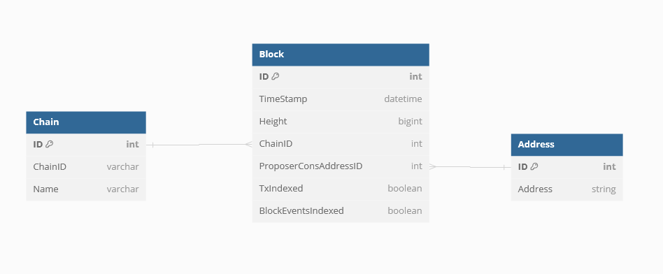

# Block Indexed Data

The application indexes block data into a well-structured data shape. In this section, you will find an overview of what blocks are and how they are indexed by the application.

## Anatomy of a Block

In Cosmos, every block contains a standard set of data that may be of interest to indexers. The block data shape that is of interest to the current iteration of Cosmos Indexer is as follows:

```json
{
    "header": {
        "height": "<block height>",
        "time": "<block time>",
        "proposer_address": "<address of the block proposer>"
    },
    ... <more block data>
}
```

Each block has a header that contains the block height, the time the block was committed, and the address of the block proposer. This data is useful for tracking the progress of the blockchain and the actors that are participating in the network.

## Indexing Block Data

### Block Model Use Case

The Block database model is used in 2 general ways:

1. Indexing the block data from the blockchain
2. Tracking the workflow of the application as it indexes blocks

For this reason, the block model contains a few, small complexities that enable the application to track the progress of the blockchain and the application's workflow in one location. See the [block.go](ttps://github.com/scalarorg/xchains-indexer/blob/main/db/models/block.go) for more information.

### Chain Model Extension

For maximum extensibility, the application has included a Chain model. This model is referenced in the Block model and is used to indicate which Chain the block is for.

This allows the indexer to track multiple chains in one database and to query blocks by chain.

### Block Model Dataset

The indexed dataset has the following general overview:

1. Block data is indexed with the following data:
   - `height`: The height of the block
   - `time`: The time the block was committed
   - `proposer_address`: The address of the block proposer
2. Application Block processing workflow is tracked with the following data:
   - `tx_indexed`: A boolean indicating if the block has been indexed for transactions
   - `block_events_indexed`: A boolean indicating if the block has been indexed for events

See the below database diagram for complete details on how the data is structured and what relationships exist between the different entities.


